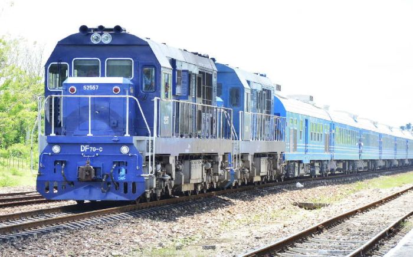
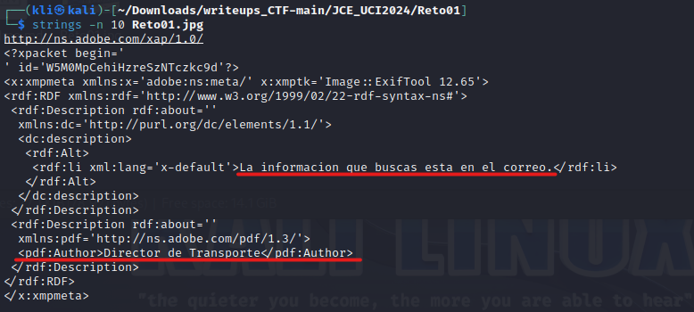
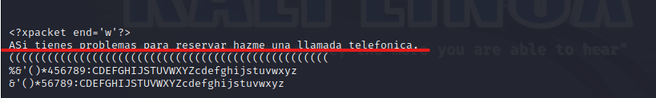
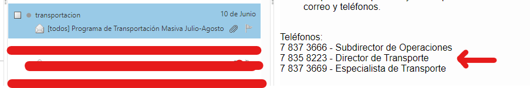
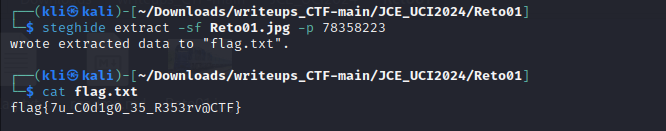

# Reto 1 - STEGO
Herramientas utilizadas:
- steghide
- strings

Este reto consiste en aplicar técnicas de esteganografía para encontrar la bandera. Para ello nos proporcionan la siguiente imagen.
<p align="center">  </p>

Primeramente utilizamos el comando ```strings -n 10 Reto01.jpg``` para buscar y mostrar todas las cadenas de texto de al menos 10 caracteres en la imagen.
```
strings -n 10 Reto01.jpg
```
<p align="center">  </p>
<p align="center">  </p>

Nótese que se obtiene información valiosa de los strings de la imagen. Un mensaje del Director de Transporte informando que la información que buscamos se encuentra en el correo.

Buscamos en el correo y observamos que el día 10 de junio recibimos un correo de la Dirección de Transporte en el cual nos proporcionan números de teléfonos para contactar con ellos. En estos números de contactos aparece el del Director de Transporte, autor del mensaje ontenido con la herramienta ```strings```.

<p align="center">  </p>

Procedemos a usar la herramienta ```steghide``` proporcionando como password el número telefónico del Director de Transporte y posteriormente listar la flag.
```
steghide extract -sf Reto01.jpg -p 78358223
```
```
cat flag.txt
```

<p align="center">  </p>
