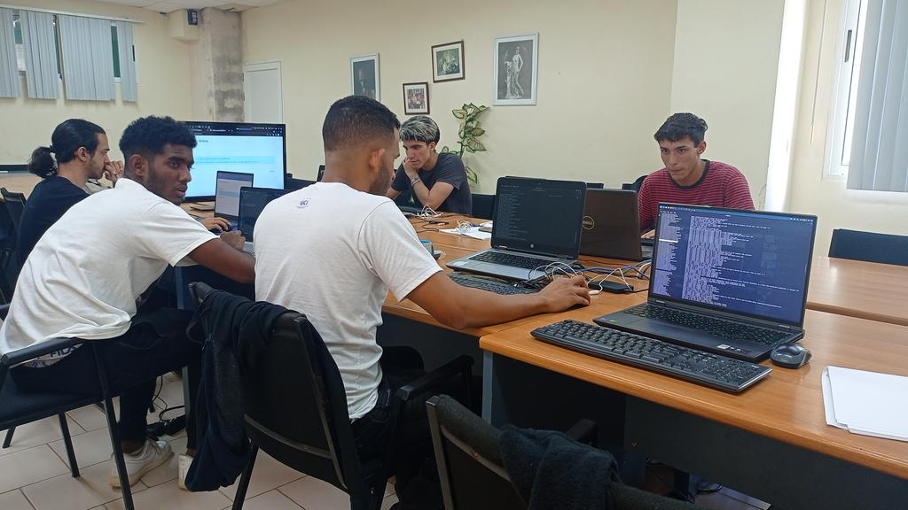
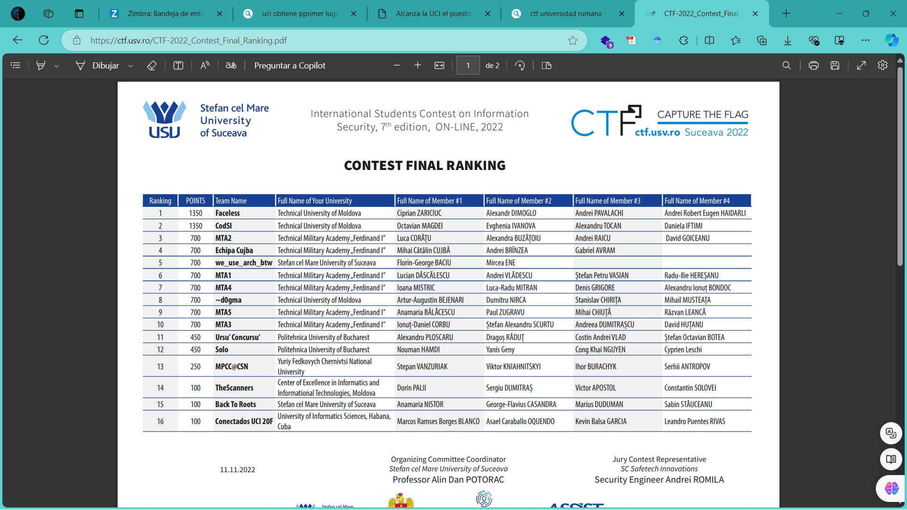

# Reto 1 - OSINT 

Este reto consiste en utilizar técnicas de OSINT para descubrir la bandera. Para ello nos proporcionan la siguiente imagen.
<p align="center">  </p>

El reto cuenta con la siguiente descripción: ¿Conoces dónde la UCI ha dejado su primera huella en las competiciones de Captura la Bandera?. A raíz de esto se comienza a hacer una búsqueda en el portal de la universidad obteniendo que la competencia a la que pertenece la imagen es al Concurso Internacional de Estudiantes CTF online de Rumanía donde la UCI obtuvo el puesto 16. ```https://ctf.usv.ro/CTF-2022_Contest_Final_Ranking.pdf```

<p align="center">  </p>

En este punto tomamos el texto ```International Students Contest on Information Security``` como password para resolver el reto.
```
flag{International_Students_Contest_on_Information_Security}
```
