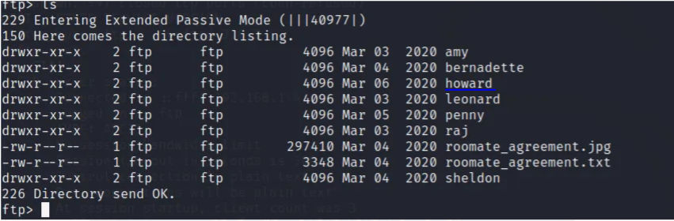
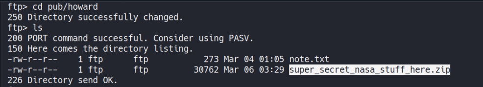
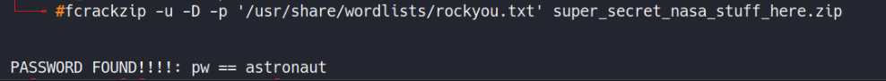
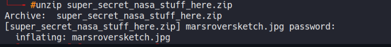
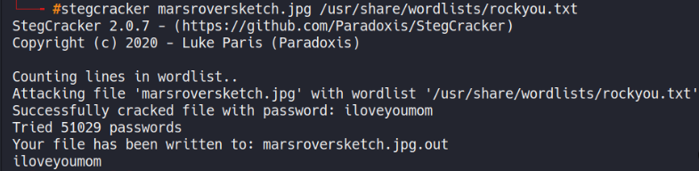

# Reto 3 The Big Bang Theory - Fun_with_flags
Herramientas utilizadas:
- nmap
- netcat
- dirbuster
- metasploit
- wpscan
- fcrackzip
- stegcracker

Este reto consiste en aplicar técnicas de hacking para encontrar 7 banderas en la máquina víctima. Luego de identificar el host procedemos a utilizar la herramienta ```nmap``` para determinar los servicios y versiones que corren por los puertos que tiene abiertos la máquina víctima.
```
nmap -sCV -p- 10.32.2.46
```
Como resultado obtenemos la siguiente información:
```
PORT     STATE SERVICE VERSION
21/tcp   open  ftp     vsftpd 3.0.3
| ftp-anon: Anonymous FTP login allowed (FTP code 230)
| -rw-r--r--    1 ftp      ftp           539 Mar 04 01:11 Welcome.txt
| -rw-r--r--    1 ftp      ftp           114 Mar 04 01:13 ftp_agreement.txt
|_drwxr-xr-x    9 ftp      ftp          4096 Mar 04 01:09 pub
| ftp-syst: 
|   STAT: 
| FTP server status:
|      Connected to ::ffff:192.168.1.5
|      Logged in as ftp
|      TYPE: ASCII
|      No session bandwidth limit
|      Session timeout in seconds is 300
|      Control connection is plain text
|      Data connections will be plain text
|      At session startup, client count was 2
|      vsFTPd 3.0.3 - secure, fast, stable
|_End of status
22/tcp   open  ssh     OpenSSH 7.2p2 Ubuntu 4ubuntu2.7 (Ubuntu Linux; protocol 2.0)
| ssh-hostkey: 
|   2048 cf:5c:ee:76:7c:48:52:06:8d:56:07:7f:f6:5d:80:f2 (RSA)
|   256 ab:bb:fa:f9:89:99:02:9e:e4:20:fa:37:4f:6f:ca:ca (ECDSA)
|_  256 ea:6d:77:f3:ff:9c:d5:dd:85:e3:1e:75:3c:7b:66:47 (ED25519)
80/tcp   open  http    Apache httpd 2.4.18 ((Ubuntu))
| http-robots.txt: 4 disallowed entries 
|_/howard /web_shell.php /backdoor /rootflag.txt
|_http-server-header: Apache/2.4.18 (Ubuntu)
|_http-title: Fun with flags!
1337/tcp open  waste?
| fingerprint-strings: 
|   DNSStatusRequestTCP, DNSVersionBindReqTCP, FourOhFourRequest, GenericLines, GetRequest, HTTPOptions, Help, JavaRMI, Kerberos, LANDesk-RC, LDAPBindReq, LDAPSearchReq, LPDString, NCP, NULL, NotesRPC, RPCCheck, RTSPRequest, SIPOptions, SMBProgNeg, SSLSessionReq, TLSSessionReq, TerminalServer, TerminalServerCookie, WMSRequest, X11Probe, afp, giop, ms-sql-s, oracle-tns: 
|_    FLAG-sheldon{cf88b37e8cb10c4005c1f2781a069cf8}
1 service unrecognized despite returning data. If you know the service/version, please submit the following fingerprint at https://nmap.org/cgi-bin/submit.cgi?new-service :
SF-Port1337-TCP:V=7.80%I=7%D=4/22%Time=5EA014FB%P=x86_64-pc-linux-gnu%r(NU
SF:LL,2F,"FLAG-sheldon{cf88b37e8cb10c4005c1f2781a069cf8}\n")%r(GenericLine
SF:s,2F,"FLAG-sheldon{cf88b37e8cb10c4005c1f2781a069cf8}\n")%r(GetRequest,2
SF:F,"FLAG-sheldon{cf88b37e8cb10c4005c1f2781a069cf8}\n")%r(HTTPOptions,2F,
```
Nótese que el puerto 1337 de la máquina víctima nos proporciona la primera flag.
```
flag{cf88b37e8cb10c4005c1f2781a069cf8}
```
Además nos brinda información sobre los demás puertos abiertos (ftp 21, ssh 22, http 80). Podemos observar que el puerto 21 permite la autenticación al servicio ftp con usuario anonymous.

Luego de revisar los ficheros que se encuentran en el servidor ftp, encontramos en el directorio de Howard un archivo .zip protegido con contraseña y una nota.

<p align="center">  </p>
<p align="center">  </p>

Luego de descargarnos los archivos, utilizamos la herramienta ```fcrackzip``` para encontrar la contraseña del comprimido.
```
fcrackzip -u -D -p '/usr/share/wordlists/rockyou.txt' super_secret_nasa_stuff_here.zip
```
<p align="center">  </p>

Descomprimimos el archivo usando ```unzip``` y obtenemos una imagen cifrada por lo que tenemos que encontrar la contraseña de la imagen para ver el contenido.
```
unzip super_secret_nasa_stuff_here.zip
```
<p align="center">  </p>

Utilizando la herramienta ```stegcracker``` encontramos la contraseña y visualizamos el contenido de la imagen obteniendo la seguda flag.
```
stegcracker marsroversketch.jpg /usr/share/wordlists/rockyou.txt
```
<p align="center">  </p>
<p align="center">  </p>

```
flag{b3d1baf22e078744ad7947519bf4}
```
