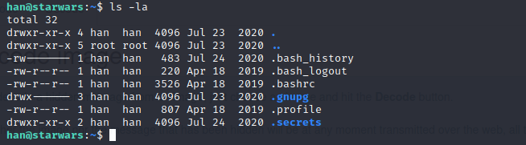

# Reto 4 - Star Wars
Herramientas utilizadas:
- nmap
- cyberchef
- gobuster
- cewl
- hydra
- wget

Este reto consiste en aplicar técnicas de hacking para encontrar tres banderas en la máquina víctima. Luego de identificar el host procedemos a utilizar la herramienta ```nmap``` para determinar los servicios y versiones que corren por los puertos que tiene abiertos la máquina víctima.
```
nmap <ip_mv> -sCV -Pn -p-
```
<p align="center">  </p>

Encontramos que la máquina víctima tiene corriendo el servicio ssh por el puerto 22 y un servicio web por el puerto 80. En este punto procedemos a revisar la web que exporta el host.

<p align="center">  </p>

En la web encontramos dos imágenes y un texto que pudiera ser una pista **"Password you shall find".** Sin embargo, si observamos el código fuente de la web, encontramos un mensaje interesante.

<p align="center">  </p>

Tomamos el mensaje codificado en base64 y se lo proporcionamos como entrada a la herramienta ```CyberChef```. En el recipe de la herramienta utilizamos el decodificador base64 y convertimos de binario a decimal la salida.
```
https://gchq.github.io/CyberChef/
```
```
MDExMTAxMDAgMDExMDEwMDAgMDExMDEwMDEgMDExMTAwMTEgMDExMDEwMDEgMDExMTAwMTEgMDExMDExMTAgMDExMDExMTEgMDExMTAxMDAgMDExMDEwMDAgMDExMDAxMDEgMDExMTAwMDAgMDExMDAwMDEgMDExMTAwMTEgMDExMTAwMTEgMDExMTAxMTEgMDExMDExMTEgMDExMTAwMTAgMDExMDAxMDA=

```
<p align="center">  </p>

El resultado no es satisfactorio, no se puede encontrar alguna flag solo un simple mensaje **"thisisnothepassword"**. Sim embargo, nos queda por revisar las imágenes que se muestran el la web. 

<p align="center">  </p>

Luego de ubicar las imágenes, procedemos a descargarlas con la herramienta ```wget```.
```
wget http://ip_mv/images/yoda.jpg
wget http://ip_mv/images/yoda.png
```
<p align="center">  </p>

Teniendo las imágenes descargadas, utilizamos la herramienta ```steganography``` para determinar y extraer texto oculto en las imágenes mediante esteganografía.
```
https://stylesuxx.github.io/steganography/ 
```
<p align="center">  </p>

Nótese que como resultado obtenemos un posible password **"babyYoda123"** que podríamos usar con algún usuario existente. Con la herramienta ```gobuster``` procedemos a realizar una búsqueda de archivos y directorios de interés en la web.
```
gobuster dir -u http://ip_mv -w /usr/share/dirbuster/wordlists/directory-list-2.3-medium.txt -x .js,.txt,.php
```
<p align="center">  </p>

Observamos archivos de interés como un **robots.txt** y un **users.js** que nos podría proporcionar algún usuario válido. Al acceder al contenido del archivo **users.js** encontramos dos posibles usuarios **"skywalker y han"**.

<p align="center">  </p>

En este punto contamos con un posible password y dos posibles usuarios válidos. Utilizamos la herramienta ```hydra``` proporcionando un archivo con los dos posibles usuarios y el password encontrado.
```
hydra -L users.txt -p babyYoda123 ssh://ip_mv
```

Encontramos que el password proporcionado pertence al usuario **han**. Dado este hallazgo, podemos acceder al host a través del servicio ssh proporcionando este usuario y el password
<p align="center">  </p>
<p align="center">  </p>
<p align="center">  </p>
<p align="center">  </p>
<p align="center">  </p>
<p align="center">  </p>
<p align="center">  </p>
<p align="center">  </p>
<p align="center">  </p>
<p align="center">  </p>
<p align="center">  </p>
<p align="center">  </p>
<p align="center">  </p>
<p align="center">  </p>
<p align="center">  </p>
<p align="center">  </p>
<p align="center">  </p>
<p align="center">  </p>
