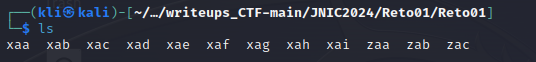
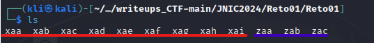
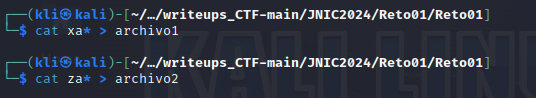
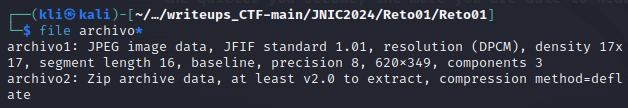
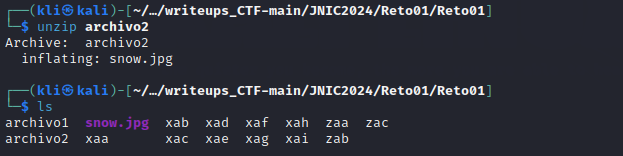
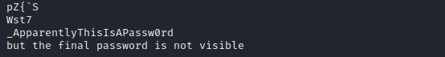
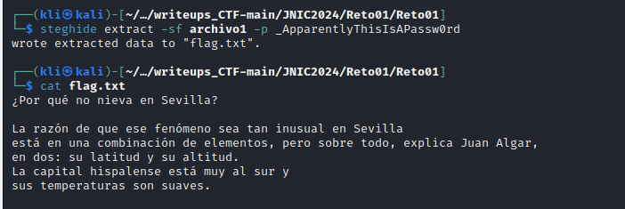
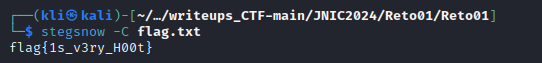

# Reto 1 - ☃️ ¿Por qué no nieva en Sevilla?
Herramientas utilizadas:
- steghide
- stegsnow
- strings

En este reto nos encontramos con 12 ficheros
<p align="center">  </p>

Nótese que los ficheros muestran un patrón en sus nombres, por lo que se puede llegar a la conlusión de que los ficheros pertenecen a 2 posibles archivos fragmentados.

<p align="center">  </p>

El siguiente paso sería concatenar los ficheros para obtener los 2 posibles archivos fragmentados

<p align="center">  </p>

Ejecutando el comando ```file``` observamos que el archivo conformado a partir de los ficheros **xaa,xab,...xai** es una imagen, mientras que el archivo conformado por los ficheros **zaa,zab,zac** es un comprimido

<p align="center">  </p>

Al descomprimir el archivo comprimido obtenemos una imagen 

<p align="center">  </p>

Usamos la herramienta ```strings``` para visualizar los strings que presenta la imagen **snow.jpg** y encontramos en las ultimas 2 líneas información valiosa. Los strings encontrados indican que se ha usado técnicas de esteganografía para ocultar la flag.
```
strings snow.jpg
```
<p align="center">  </p>

Posteriormente de identificar el uso de esteganogafía para ocultar la flag y obtener una posible contraseña, procedemos a usar la herramienta ```steghide``` para obtener la información que se esta ocultando. 

<p align="center">  </p>

Encontramos un texto pero en él no se visualiza la flag. Sin embargo, el hecho de que la imagen **snow.jpg** tenga ese nombre nos da una pista. Usaremos la herramienta ```stegsnow``` que se utiliza para ocultar mensajes en texto ASCII agregando espacios en blanco a el final de las líneas. Con esta herramienta y la información encontrada con steghide obtendremos la flag.

<p align="center">  </p>
