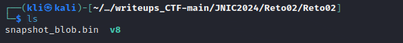
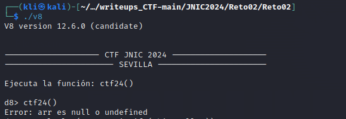
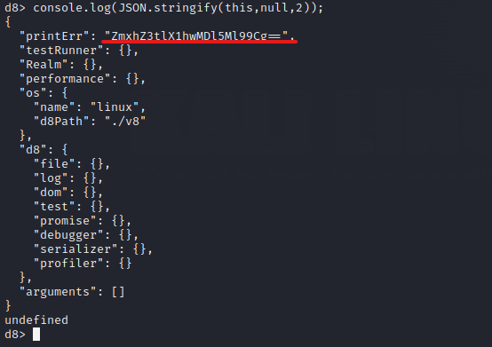
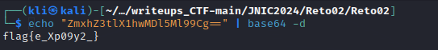

# Reto 2 - 👩🏼‍💻 Javascript
En este reto nos encontramos con 2 ficheros
- **v8** motor de JavaScript V8
- **snapshots binarios** contienen información sobre el estado de la memoria y las funciones JavaScript precompiladas.

<p align="center">  </p>

Ejecutamos el archivo v8 desde la línea de comandos y obtenemos podemos ejecutar una función ```ctf24()```. Sin embargo, al ejecutar la función nos lanza un error.
```
./v8
```
<p align="center">  </p>

Posteriormente utilizamos el comando ```console.log(JSON.stringify(this, null, 2));``` que nos muestra una representación formateada en JSON del objeto actual en la consola, obteniendo así una posible flag codeada en base64

<p align="center">  </p>

Decodificamos la cadena encontrada y obtenemos la flag del reto

<p align="center">  </p>
