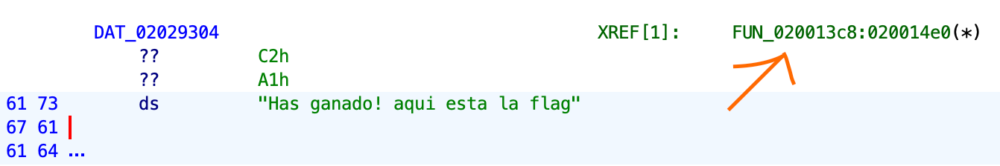
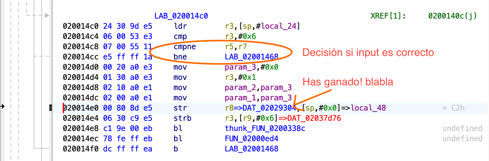
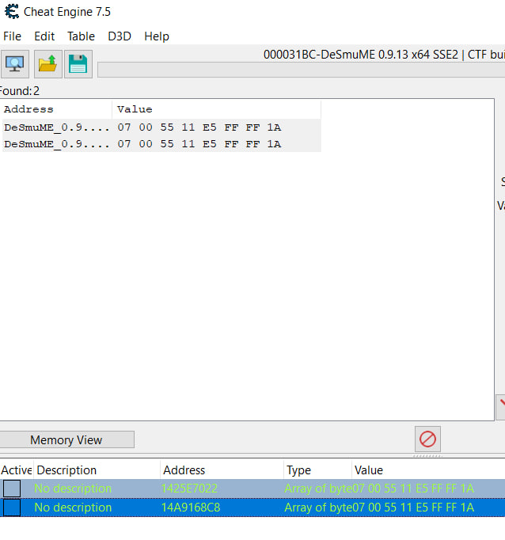
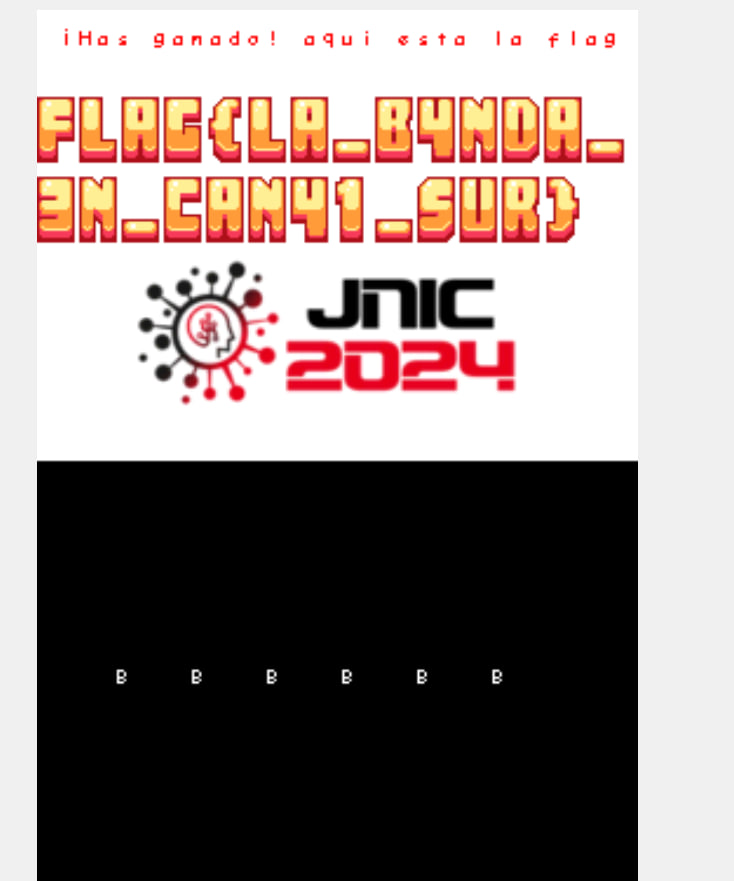

# Reto 3 - 🎮 Volvamos a nuestra infancia
Herramientas utilizadas:
- Ghidra
- DeSmuME_0.9.13_x64
- Cheat Engine

En este reto tenemos un juego de la nintendo DS, que pide que pulsemos una serie de teclas. Se supone que si acertamos la combinación, nos dará la flag.

Lo primero que hemos hecho es cargar el binario en GHidra.
Buscando strings interesantes, hemos encontrado el String "Has ganado! aqui esta la flag".
<p align="center">  </p>

Por lo que vamos a ver donde se usa ese string.
<p align="center">  </p>

Con el emulador, comprobamos que al poner un breakpoint en esta posición de memoria, se para al comprobar si la secuencia introducida es correcta, por lo que parece ser la comprobación que valida si hemos acertado el código. Probamos simplemente a cambiar el compare equals (```cmpeq```, en ```020014c8```) por compare not equals (```cmpne```). Reensamblamos y vemos que los bytes que cambian son los siguientes:
<p align="center">  </p>

Entonces, se busca:
```
- 020014c8 07 00 55 01     cmpeq      r5,r7
- 020014cc e5 ff ff 1a     bne        LAB_02001468
```
Y se reemplaza por:
```
- 020014c8 07 00 55 11     cmpne      r5,r7
- 020014cc e5 ff ff 1a     bne        LAB_02001468
```

Eso lo hacemos con Cheat Engine:
<p align="center">  </p>

Con esto obtenemos la flag enviando cualquier entrada.
```flag{la_b4nda_3n_c4n41_sur}```
<p align="center">  </p>
