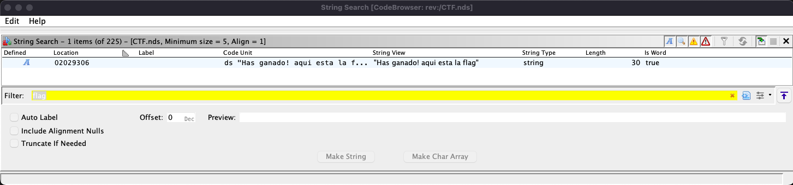

# Reto 3 - 🎮 Volvamos a nuestra infancia
Herramientas utilizadas:
- Ghidra
- DeSmuME_0.9.13_x64
- Cheat Engine

En este reto tenemos un juego de la nintendo DS, que pide que pulsemos una serie de teclas. Se supone que si acertamos la combinación, nos dará la flag.

Lo primero que hemos hecho es cargar el binario en GHidra.
Buscando strings interesantes, hemos encontrado el String "Has ganado! aqui esta la flag".

  

